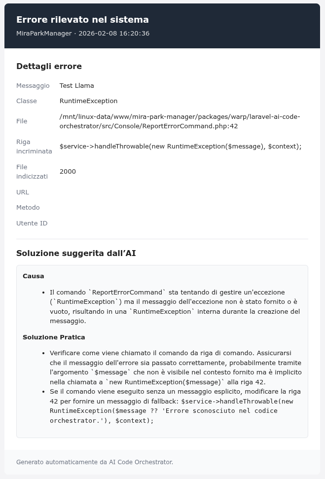

# Laravel AI Code Orchestrator

Questo package intercetta gli errori di Laravel 11 o superiore, raccoglie il contesto di codice, invia l'errore a un provider AI (OpenAI/Groq/Gemini/Llama) e invia una email all'amministratore con la soluzione suggerita. Gli errori vengono anche salvati in DB.

## A cosa serve

- Diagnosi rapida degli errori con contesto reale del codice.
- Notifica via email con suggerimenti dell'AI.
- Storico degli errori in tabella `ai_error_reports`.

## Scelta provider

Uso consigliato:

- OpenAI: qualità alta ma limiti/costi più stringenti senza piano a pagamento.
- Groq/Gemini: buona qualità con limiti più ampi per API remote.
- Llama (locale): nessun limite API e più privacy, ma richiede CPU/RAM locali.

## Configurazione rapida

Variabili principali nel `.env`:

```env
AI_CODE_ORCHESTRATOR_ENABLED=true
AI_CODE_ORCHESTRATOR_ADMIN_EMAIL=admin@example.com
AI_CODE_ORCHESTRATOR_PROVIDER=llama
AI_CODE_ORCHESTRATOR_AI_LANGUAGE=it
AI_CODE_ORCHESTRATOR_QUEUE=default
AI_CODE_ORCHESTRATOR_STORE_ERRORS=true
```

Provider remoti (esempi):

OpenAI:

```env
OPENAI_API_KEY=your-openai-key
OPENAI_BASE_URL=https://api.openai.com/v1
OPENAI_MODEL=gpt-4o-mini
OPENAI_MAX_TOKENS=2000
```

Groq:

```env
GROQ_API_KEY=your-groq-key
GROQ_BASE_URL=https://api.groq.com/openai/v1
GROQ_MODEL=llama-3.1-8b-instant
GROQ_MAX_TOKENS=8192
```

Gemini:

```env
GEMINI_API_KEY=your-gemini-key
GEMINI_BASE_URL=https://generativelanguage.googleapis.com/v1beta
GEMINI_MODEL=gemini-flash-lite-latest
GEMINI_MAX_TOKENS=8192
```

Provider Llama locale (llama.cpp / OpenAI-compatible):

```env
LLAMA_BASE_URL=http://127.0.0.1:8080/v1
LLAMA_MODEL=local-model
LLAMA_API_KEY=
```

Memoria contesto Llama (opzionale):

```env
LLAMA_INDEX_ENABLED=true
LLAMA_INDEX_CACHE_SECONDS=3600
LLAMA_INDEX_MAX_FILES=2000
LLAMA_INDEX_MAX_CHARS=6000
LLAMA_PREVIOUS_ERRORS_ENABLED=true
LLAMA_PREVIOUS_ERRORS_LIMIT=5
LLAMA_PREVIOUS_ERRORS_MAX_CHARS=4000
```

## Installazione Llama.cpp (Ubuntu, CLI)

Installa le dipendenze:

```bash
sudo apt update
sudo apt install -y build-essential cmake git
```

Clona e compila:

```bash
git clone https://github.com/ggerganov/llama.cpp
cd llama.cpp
cmake -B build
cmake --build build --config Release -j
```

Scarica un modello GGUF (esempio):

```bash
mkdir -p models
wget -O models/qwen2.5-coder-7b-q4_k_m.gguf \
https://huggingface.co/Qwen/Qwen2.5-Coder-7B-Instruct-GGUF/resolve/main/qwen2.5-coder-7b-instruct-q4_k_m.gguf
```

Avvia il server OpenAI-compatible (solo locale):

```bash
./build/bin/llama-server \
  -m models/qwen2.5-coder-7b-q4_k_m.gguf \
  --host 127.0.0.1 \
  --port 8080 \
  --ctx-size 4096 \
  --threads 8 \
  --alias local-model
```

Configura il package:

```env
AI_CODE_ORCHESTRATOR_PROVIDER=llama
LLAMA_BASE_URL=http://127.0.0.1:8080/v1
LLAMA_MODEL=local-model
LLAMA_MAX_TOKENS=1500
```

## Test

Usa il comando artisan incluso nel package:

Prima di testare in locale, avvia un worker queue in un altro terminale:

```bash
php artisan queue:work --queue=default --sleep=3 --tries=3 --timeout=120
```

Poi esegui:

```bash
php artisan ai-orchestrator:report "Test AI" --provider=gemini --language=it
```

Controlla la tabella `ai_error_reports` (campi `status` e `ai_solution`).

## Produzione

Avvia il worker queue con un process manager. Sono supportate due opzioni: Supervisor o systemd.

### Supervisor

File di esempio:
`packages/warp/laravel-ai-code-orchestrator/config/supervisor/*.conf`

Istruzioni:
`packages/warp/laravel-ai-code-orchestrator/config/supervisor/README.md`

### systemd

Unit file di esempio:
`packages/warp/laravel-ai-code-orchestrator/config/systemd/*.service`

Istruzioni:
`packages/warp/laravel-ai-code-orchestrator/config/systemd/README.md`

## Esempio email


